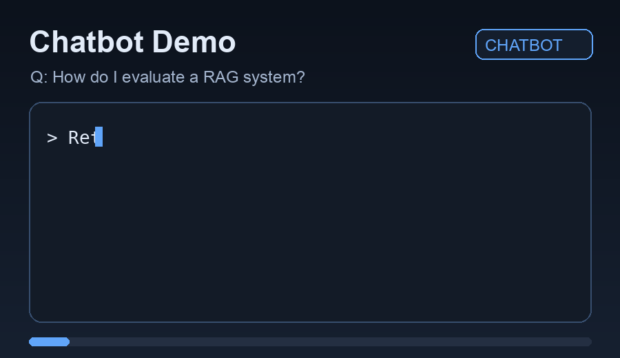
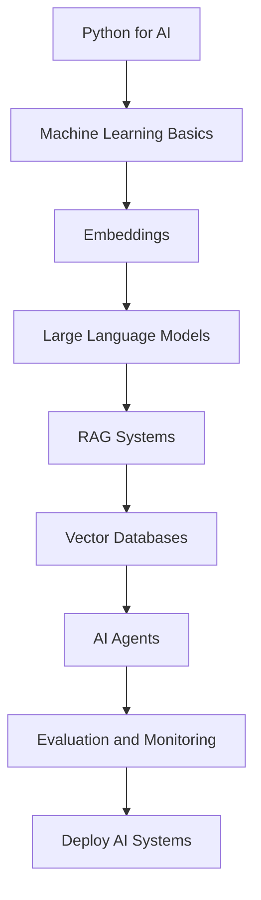

# AI Engineer in 90 Days

> ⭐ If this roadmap helps you build practical AI systems, star the repository and share it with another developer.

Build real AI systems, RAG pipelines, and AI agents in 90 days.

A practical roadmap for developers who want to become AI Engineers by building real projects instead of studying theory.


---

## Demo



---

## Why This Repository

Most AI learning paths focus on theory only.

This roadmap focuses on building, shipping, and evaluating real AI systems in a clear 90-day path.

---

## Who This Is For

This repository is designed for developers who:

- know basic Python
- want hands-on projects instead of only theory
- want to understand how production LLM systems work
- want a practical transition into AI engineering

---

## What You Will Learn

By completing this roadmap, you will learn how to:

- build LLM-powered applications with clean architecture
- design and implement RAG pipelines
- work with embeddings and semantic retrieval
- build AI agents that use tools and multi-step workflows
- evaluate AI system quality and reliability
- deploy AI systems as APIs and production services

---

## AI Engineering Skills Covered

Core topics in this roadmap:

- prompt engineering
- embeddings
- retrieval augmented generation (RAG)
- vector databases
- AI agents
- evaluation and monitoring
- API design and deployment

---

## Learning Outcomes After 90 Days

After finishing this roadmap, you should be able to:

- ship an end-to-end AI chatbot with retrieval support
- build and test a RAG search system over custom documents
- implement an agent loop that plans and executes tasks
- expose AI functionality through a production-style API
- evaluate output quality using practical metrics and traces

---

## Suggested Weekly Study Schedule

A simple weekly workflow that works well for most developers:

- Monday: read the weekly README and review core concepts
- Tuesday: run the example scripts and inspect code paths
- Wednesday: implement one small extension or refactor
- Thursday: build or improve the weekly mini-project
- Friday: write notes, document learnings, and share progress
- Weekend (optional): revisit weak points or contribute a PR

---

## 90 Day Roadmap



| Days  | Track                                                              | Focus                          | Target Outcome                    |
| ----- | ------------------------------------------------------------------ | ------------------------------ | --------------------------------- |
| 01-09 | [week01_python_for_ai](weeks/week01_python_for_ai/README.md)       | Python for AI                  | Data structures, scripts, APIs    |
| 10-18 | [week02_machine_learning](weeks/week02_machine_learning/README.md) | Machine Learning Basics        | Train and evaluate ML models      |
| 19-27 | [week03_embeddings](weeks/week03_embeddings/README.md)             | Embeddings                     | Build vector representations      |
| 28-36 | [week04_llms](weeks/week04_llms/README.md)                         | Large Language Models          | Prompting and LLM usage           |
| 37-45 | [week05_rag](weeks/week05_rag/README.md)                           | Retrieval Augmented Generation | Build RAG pipeline                |
| 46-54 | [week06_vector_databases](weeks/week06_vector_databases/README.md) | Vector Databases               | Indexing and search               |
| 55-63 | [week07_agents](weeks/week07_agents/README.md)                     | AI Agents                      | Tool use and multi-step reasoning |
| 64-72 | [week08_ai_tools](weeks/week08_ai_tools/README.md)                 | Evaluation and Monitoring      | Metrics and tracing               |
| 73-81 | [week09_build_projects](weeks/week09_build_projects/README.md)     | Build Projects                 | Implement real systems            |
| 82-90 | [week10_deploy_ai](weeks/week10_deploy_ai/README.md)               | Deploy AI Systems              | Ship to cloud                     |

---

## Systems You Will Build

During the roadmap you will build systems similar to real AI products:

1. [AI chatbot](projects/ai_chatbot/README.md) for conversational UX
2. [RAG knowledge base / search engine](projects/rag_search_engine/README.md) for grounded answers
3. [AI code assistant](projects/ai_code_assistant/README.md) for developer workflows
4. AI research assistant (stretch goal) for literature and synthesis
5. [AI API](projects/ai_api/README.md) for integration and serving
6. [AI document analyzer](projects/ai_document_analyzer/README.md) for document-level tasks

---

## Final Capstone Project: AI Knowledge Assistant

The capstone project combines the full AI engineering stack into one production-style system.

It combines:

- RAG
- AI agents
- vector search
- API
- deployment

Capstone objective: build an assistant that retrieves trusted knowledge, reasons across tools, and serves answers through an API endpoint ready for deployment.

---

## Example Output

Question:
How do I evaluate a RAG system?

Answer:
To evaluate a RAG system you should measure:
- retrieval precision
- context relevance
- answer faithfulness
- latency

---

## Quick Start

```bash
git clone https://github.com/your-username/ai-engineer-in-90-days.git
cd ai-engineer-in-90-days

python3 examples/embeddings.py
python3 examples/vector_search.py
python3 examples/rag_pipeline.py
python3 examples/agent_loop.py
```

---

## Example Code

```python
from examples.rag_pipeline import retrieve, generate_answer

question = "How do I evaluate a RAG system?"
chunks = retrieve(question)
print(generate_answer(question, chunks))
```

---

## Hands-on Exercises

Use this learning flow:
`roadmap -> examples -> exercises -> projects`

Exercises for practice:

- [Build Your Own Embedding Search](exercises/build-your-own-embedding-search.md)
- [Build Your Own RAG](exercises/build-your-own-rag.md)
- [Build Your Own Agent](exercises/build-your-own-agent.md)

---

## AI Engineering Interview Preparation

Use these interview prep guides to practice practical AI engineering questions:

- [AI Engineer Interview Questions](interview-prep/ai-engineer-interview-questions.md)
- [RAG Interview Questions](interview-prep/rag-interview-questions.md)
- [LLM Interview Questions](interview-prep/llm-interview-questions.md)
- [AI System Design Questions](interview-prep/system-design-ai.md)

---

## Common Failure Modes in AI Systems

Practical failure patterns and mitigations for production AI systems:

- [Common Failure Modes in AI Systems](resources/common-failure-modes-ai-systems.md)

---

## Debugging AI Systems

Practical debugging runbook for retrieval, prompts, hallucinations, tools, agents, and latency:

- [Debugging AI Systems](resources/debugging-ai-systems.md)

---

## Build vs Buy Decisions in AI Engineering

Practical trade-offs for architecture and tooling decisions in production AI systems:

- [Build vs Buy Decisions in AI Engineering](resources/build-vs-buy-decisions-ai-engineering.md)

---

## Production Checklists

Practical checklists for shipping and operating production AI systems:

- [RAG Production Checklist](checklists/rag-production-checklist.md)
- [LLM App Production Checklist](checklists/llm-app-production-checklist.md)
- [AI Agent Production Checklist](checklists/ai-agent-checklist.md)

---

## Evaluation Recipes

Practical evaluation guides for improving AI system quality in production:

- [Retrieval Evaluation](evaluation-recipes/retrieval-evaluation.md)
- [Answer Quality Evaluation](evaluation-recipes/answer-quality-evaluation.md)
- [Faithfulness Checking](evaluation-recipes/faithfulness-checking.md)
- [Prompt Comparison](evaluation-recipes/prompt-comparison.md)
- [Model Comparison](evaluation-recipes/model-comparison.md)
- [Agent Evaluation](evaluation-recipes/agent-evaluation.md)

---

## Architecture Patterns

Common AI engineering architecture patterns with practical trade-offs:

- [Simple LLM App](architecture-patterns/simple-llm-app.md)
- [RAG Pipeline](architecture-patterns/rag-pipeline.md)
- [Ingestion Pipeline](architecture-patterns/ingestion-pipeline.md)
- [Tool-Calling Assistant](architecture-patterns/tool-calling-assistant.md)
- [Planner-Executor Agent](architecture-patterns/planner-executor-agent.md)
- [Batch Evaluation Pipeline](architecture-patterns/batch-evaluation-pipeline.md)

---

## Case Studies

Practical AI engineering case studies from problem framing to implementation path:

- [Support Assistant Case Study](case-studies/support-assistant-case-study.md)
- [Documentation Search Assistant Case Study](case-studies/documentation-search-assistant-case-study.md)
- [Internal Knowledge Base Assistant Case Study](case-studies/internal-knowledge-base-assistant-case-study.md)
- [AI Document Analyzer Case Study](case-studies/ai-document-analyzer-case-study.md)

---

## Glossary

Practical definitions of core AI engineering terms:

- [AI Engineering Glossary](resources/glossary.md)

---

## Recommended Learning Paths

Choose a path based on your background and goal:

- [Recommended Learning Paths](resources/recommended-learning-paths.md)

---

## Tooling Comparisons

Practical engineering comparisons for common AI tooling choices:

- [Vector Databases Comparison](tool-comparisons/vector-databases-comparison.md)
- [LLM Frameworks Comparison](tool-comparisons/llm-frameworks-comparison.md)
- [Evaluation Tools Comparison](tool-comparisons/evaluation-tools-comparison.md)
- [Observability Tools Comparison](tool-comparisons/observability-tools-comparison.md)

---

## Benchmarks

Lightweight benchmark-style experiments for core retrieval decisions:

- [Chunk Size Comparison](benchmarks/chunk-size-comparison.md)
- [Embedding Model Comparison](benchmarks/embedding-model-comparison.md)
- [Retrieval Strategy Comparison](benchmarks/retrieval-strategy-comparison.md)

---

## From Prototype to Production

Practical implementation guide for hardening AI apps from notebook to production:

- [From Prototype to Production](resources/from-prototype-to-production.md)

---

## Tools

Full reference list: [resources/tools.md](resources/tools.md)

Common tools used throughout the projects:

- Python
- Jupyter
- uv / pip / poetry
- OpenAI API
- Anthropic API
- Google Gemini API
- LangChain
- LlamaIndex
- DSPy
- FAISS
- Chroma
- Qdrant
- Pinecone
- FastAPI
- Docker
- GitHub Actions
- Langfuse
- Helicone
- Promptfoo
- Ragas

---

## Diagrams

### RAG Architecture


### AI Agent Loop


### LLM Pipeline


---

## Progress Checklist

### Learning Path

- [ ] Week 01: Python for AI
- [ ] Week 02: Machine Learning Basics
- [ ] Week 03: Embeddings
- [ ] Week 04: LLMs
- [ ] Week 05: RAG
- [ ] Week 06: Vector Databases
- [ ] Week 07: Agents
- [ ] Week 08: Evaluation and Monitoring
- [ ] Week 09: Build Projects
- [ ] Week 10: Deploy AI Systems

### Project Milestones

- [ ] Ship `ai_chatbot` MVP
- [ ] Ship `rag_search_engine` MVP
- [ ] Ship `ai_code_assistant` MVP
- [ ] Ship `ai_document_analyzer` MVP
- [ ] Ship `ai_api` MVP

---

## Repository Structure

```
ai-engineer-in-90-days/
├── README.md
├── CONTRIBUTING.md
├── LICENSE
├── weeks/
├── exercises/
├── interview-prep/
├── checklists/
├── evaluation-recipes/
├── architecture-patterns/
├── case-studies/
├── tool-comparisons/
├── benchmarks/
├── projects/
├── diagrams/
├── examples/
└── resources/
```

---

## Community

Contributions, ideas, and constructive feedback are welcome.

- Open an issue to suggest improvements or report gaps
- Open a pull request for fixes, examples, or docs upgrades
- Share progress and lessons learned in GitHub Discussions (or issues if discussions are not enabled)

See [CONTRIBUTING.md](CONTRIBUTING.md) for contribution guidelines.

---

## Related Repositories

Companion repositories can be linked here as the ecosystem grows:

- `ai-engineer-in-90-days-starter` (coming soon)
- `ai-engineer-in-90-days-projects` (coming soon)
- `ai-engineer-in-90-days-evals` (coming soon)

---

## Suggested GitHub Topics

Use these repository topics for better discoverability:

- `ai`
- `ai-engineering`
- `machine-learning`
- `rag`
- `llm`
- `ai-agents`
- `vector-database`
- `prompt-engineering`
- `ai-roadmap`

---

## Star History

[](https://star-history.com/#natiixnt/ai-engineer-in-90-days&Date)

---

## License

Distributed under the MIT License. See [LICENSE](LICENSE).
