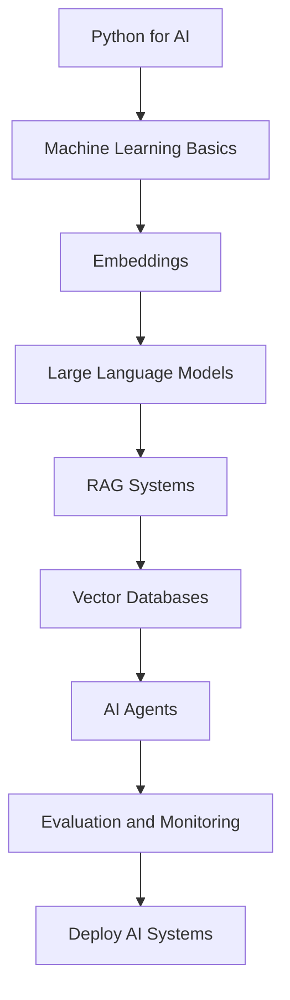
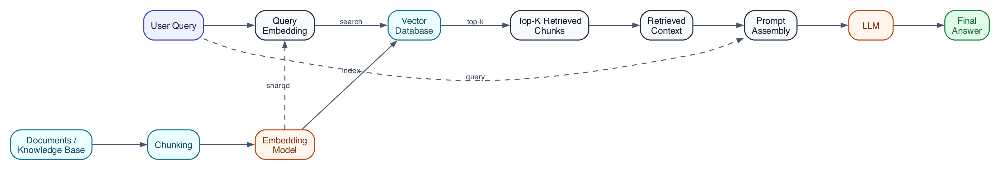
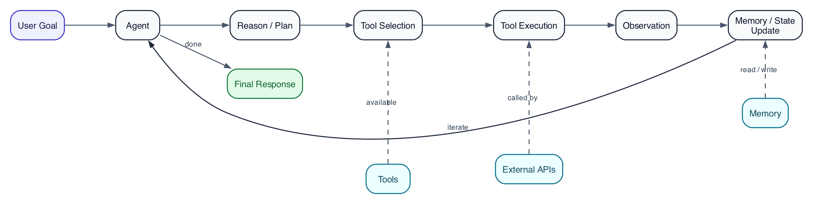
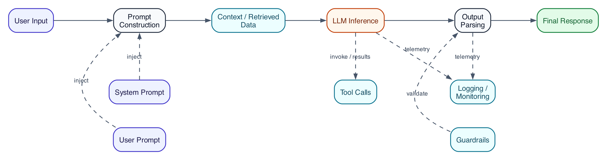

# AI Engineer in 90 Days

Build real AI systems, RAG pipelines, and AI agents in 90 days.

A practical roadmap for developers who want to become AI Engineers by building real projects instead of studying theory.


---

## Why This Repository

Most AI learning paths focus on theory or research papers.

This roadmap focuses on **building real AI systems**.

The goal is simple: after 90 days you should be able to design, build, and deploy production-style AI applications.

This repository contains:

* a structured 90-day roadmap
* runnable Python examples
* architecture explanations
* real AI projects
* deployment guidance

---

## Who This Is For

This repository is designed for developers who want to move into AI engineering.

You will benefit if you:

* know basic Python
* want hands-on projects instead of theory
* want to learn how LLM systems actually work
* want to build real AI applications

---

## What You Will Learn

By completing this roadmap you will learn how to:

* build LLM powered applications
* design RAG systems
* use embeddings and vector databases
* build AI agents
* evaluate AI systems
* deploy AI applications to production

---

## AI Engineering Skills Covered

The roadmap covers the core practical skills used by modern AI engineers:

* Prompt engineering
* Embeddings and semantic search
* Retrieval Augmented Generation
* Vector databases
* AI agents and tool use
* Evaluation and monitoring
* Production deployment

---

## 90 Day Roadmap



| Days  | Track                                                              | Focus                          | Target Outcome                    |
| ----- | ------------------------------------------------------------------ | ------------------------------ | --------------------------------- |
| 01-09 | [week01_python_for_ai](weeks/week01_python_for_ai/README.md)       | Python for AI                  | Data structures, scripts, APIs    |
| 10-18 | [week02_machine_learning](weeks/week02_machine_learning/README.md) | Machine Learning Basics        | Train and evaluate ML models      |
| 19-27 | [week03_embeddings](weeks/week03_embeddings/README.md)             | Embeddings                     | Build vector representations      |
| 28-36 | [week04_llms](weeks/week04_llms/README.md)                         | Large Language Models          | Prompting and LLM usage           |
| 37-45 | [week05_rag](weeks/week05_rag/README.md)                           | Retrieval Augmented Generation | Build RAG pipeline                |
| 46-54 | [week06_vector_databases](weeks/week06_vector_databases/README.md) | Vector Databases               | Indexing and search               |
| 55-63 | [week07_agents](weeks/week07_agents/README.md)                     | AI Agents                      | Tool use and multi-step reasoning |
| 64-72 | [week08_ai_tools](weeks/week08_ai_tools/README.md)                 | Evaluation and Monitoring      | Metrics and tracing               |
| 73-81 | [week09_build_projects](weeks/week09_build_projects/README.md)     | Build Projects                 | Implement real systems            |
| 82-90 | [week10_deploy_ai](weeks/week10_deploy_ai/README.md)               | Deploy AI Systems              | Ship to cloud                     |

---

## Progress Checklist

### Learning Path

* [ ] Week 01: Python for AI
* [ ] Week 02: Machine Learning Basics
* [ ] Week 03: Embeddings
* [ ] Week 04: LLMs
* [ ] Week 05: RAG
* [ ] Week 06: Vector Databases
* [ ] Week 07: Agents
* [ ] Week 08: Evaluation and Monitoring
* [ ] Week 09: Build Projects
* [ ] Week 10: Deploy AI Systems

### Project Milestones

* [ ] Ship `ai_chatbot` MVP
* [ ] Ship `rag_search_engine` MVP
* [ ] Ship `ai_code_assistant` MVP
* [ ] Ship `ai_document_analyzer` MVP
* [ ] Ship `ai_api` MVP

---

## Systems You Will Build

During the roadmap you will implement systems similar to those used in real AI products.

1. [AI chatbot](projects/ai_chatbot/README.md)
2. [RAG knowledge base / search engine](projects/rag_search_engine/README.md)
3. [AI code assistant](projects/ai_code_assistant/README.md)
4. AI research assistant (stretch goal)
5. [AI API](projects/ai_api/README.md)
6. [AI document analyzer](projects/ai_document_analyzer/README.md)

---

## Tools

Full reference list: [resources/tools.md](resources/tools.md)

Common tools used throughout the projects:

* Python
* Jupyter
* uv / pip / poetry
* OpenAI API
* Anthropic API
* Google Gemini API
* LangChain
* LlamaIndex
* DSPy
* FAISS
* Chroma
* Qdrant
* Pinecone
* FastAPI
* Docker
* GitHub Actions
* Langfuse
* Helicone
* Promptfoo
* Ragas

---

## Diagrams

### RAG Architecture



### AI Agent Loop



### LLM Pipeline



---

## Quick Start

```bash
git clone https://github.com/your-username/ai-engineer-in-90-days.git
cd ai-engineer-in-90-days

python3 examples/embeddings.py
python3 examples/vector_search.py
python3 examples/rag_pipeline.py
python3 examples/agent_loop.py
```

---

## Example Code

```python
from examples.rag_pipeline import retrieve, generate_answer

question = "How do I evaluate a RAG system?"
chunks = retrieve(question)
print(generate_answer(question, chunks))
```

---

## Repository Structure

```
ai-engineer-in-90-days/
├── README.md
├── CONTRIBUTING.md
├── LICENSE
├── weeks/
├── projects/
├── diagrams/
├── examples/
└── resources/
```

---

## Star History

[](https://star-history.com/#natiixnt/ai-engineer-in-90-days&Date)

---

## Contributing

See [CONTRIBUTING.md](CONTRIBUTING.md).

Contributions are welcome.

---

## License

Distributed under the MIT License. See [LICENSE](LICENSE).
